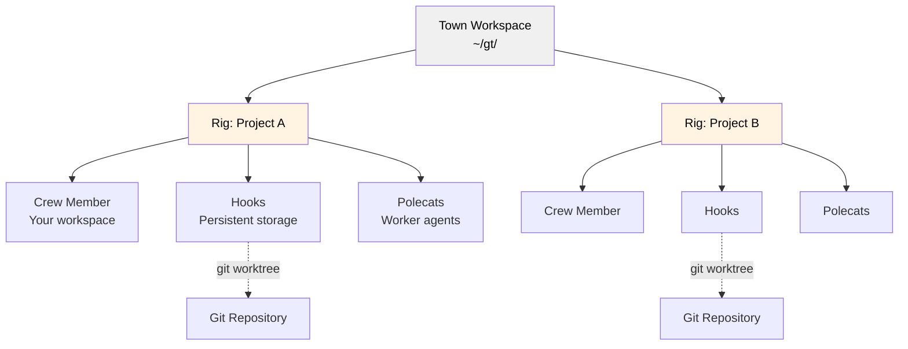
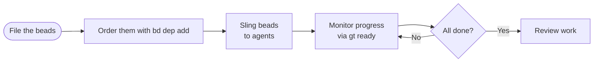
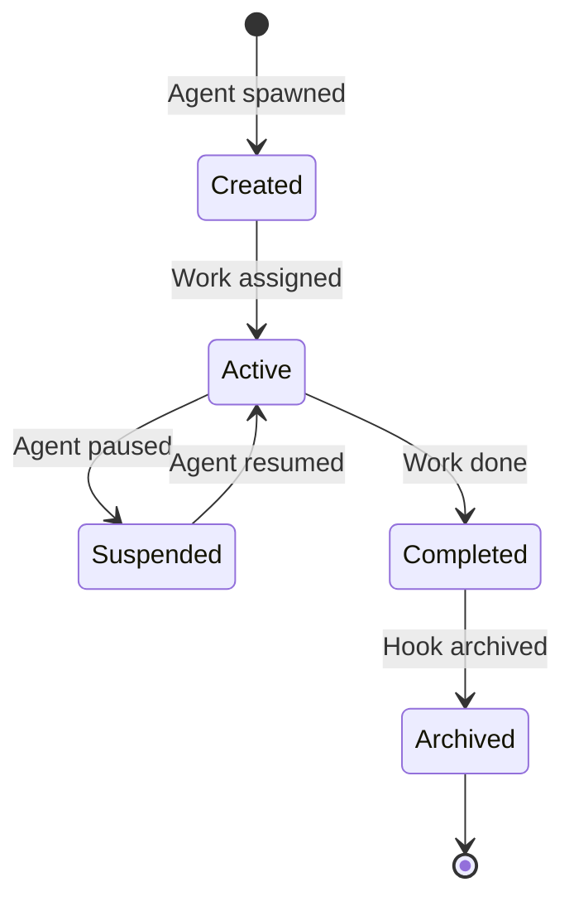

# Gas Town

**Multi-agent orchestration system for Claude Code with persistent work tracking**

## Overview

Gas Town is a workspace manager that lets you coordinate multiple Claude Code agents working on different tasks. Instead of losing context when agents restart, Gas Town persists work state in git-backed hooks, enabling reliable multi-agent workflows.

### What Problem Does This Solve?

| Challenge                       | Gas Town Solution                            |
| ------------------------------- | -------------------------------------------- |
| Agents lose context on restart  | Work persists in git-backed hooks            |
| Manual agent coordination       | Built-in mailboxes, identities, and handoffs |
| 4-10 agents become chaotic      | Scale comfortably to 20-30 agents            |
| Work state lost in agent memory | Work state stored in Beads ledger            |

### Architecture



## Core Concepts

### The Operator 🧑💻

You are the town's coordinator. Work from your own shell: file beads, order
them with `bd dep add`, dispatch them with `gt sling`, and watch progress with
`gt ready` and `gt agents`. A crew session gives you a persistent tmux-backed
workspace inside a rig when you want one.

### Town 🏘️

Your workspace directory (e.g., `~/gt/`). Contains all projects, agents, and configuration.

### Rigs 🏗️

Project containers. Each rig wraps a git repository and manages its associated agents.

### Crew Members 👤

Your personal workspace within a rig. Where you do hands-on work.

### Polecats 🦨

Worker agents with persistent identity but ephemeral sessions. Spawned for tasks, sessions end on completion, but identity and work history persist.

### Hooks 🪝

Git worktree-based persistent storage for agent work. Survives crashes and restarts.

### Beads Integration 📿

Git-backed issue tracking system that stores work state as structured data.

**Bead IDs** (also called **issue IDs**) use a prefix + 5-character alphanumeric format (e.g., `gt-abc12`, `hq-x7k2m`). The prefix indicates the item's origin or rig. Commands like `gt sling` and `bd dep add` accept these IDs to reference specific work items. The terms "bead" and "issue" are used interchangeably—beads are the underlying data format, while issues are the work items stored as beads.

### Molecules 🧬

Workflow templates that coordinate multi-step work. Formulas (TOML definitions) are instantiated as molecules with tracked steps. Two modes: root-only wisps (steps materialized at runtime, lightweight) and poured wisps (steps materialized as sub-wisps with checkpoint recovery). See [Molecules](docs/concepts/molecules.md).

### Supervision

The daemon is the only process that kills or restarts an agent. Its `patrol_scan` tick restarts a polecat whose session died while it held work, closes orphaned molecules and comments on stranded work. No long-running LLM session watches the town. See [ADR 0003](docs/adr/0003-one-supervisor-no-idle-llm.md) and [ADR 0005](docs/adr/0005-patrol-scan-tick.md).

### Landing 🛬

When a polecat finishes, `gt done` rebases onto main, runs the fast gate, pushes the branch and labels the work bead `gt:ready-to-land`. The daemon's landing worker, one per rig, merges the branch onto main in a throwaway worktree, runs the gate and review on the merged tree, pushes, and writes the landing record to the work bead. Workers never push main. See [ADR 0004](docs/adr/0004-daemon-lands-work.md).

### Escalation 🚨

Severity-routed issue escalation. Agents that hit blockers escalate via `gt escalate`, which creates tracked beads and routes the higher severities to the operator's email or SMS. Severity levels: CRITICAL (P0), HIGH (P1), MEDIUM (P2). See [Escalation](docs/design/escalation.md).

### Scheduler ⏱️

Config-driven capacity governor for polecat dispatch. Prevents API rate limit exhaustion by batching dispatch under configurable concurrency limits. Default is direct dispatch; set `scheduler.max_polecats` to enable deferred dispatch with the daemon. See [Scheduler](docs/design/scheduler.md).

> **New to Gas Town?** See the [Glossary](docs/glossary.md) for a complete guide to terminology and concepts.

## Installation

Choose one of the two setup paths below: install Gas Town on your host, or run it inside a Docker container.

### Prerequisites

Native installs require the host tools below. Docker installs only require Docker Compose on the host; the image supplies Go, Dolt, `bd`, tmux, and CLI utilities inside the container. The platform steps below say when a path installs `gt`, `bd`, and `dolt` for you and when you install them separately.

| Tool | Version | Notes |
|---|---|---|
| Git | 2.20+ | Worktree support |
| Go | 1.26.2+ (see `go.mod`) | Required for the Linux and Windows paths and for macOS source builds. Not needed for `brew install gastown` or Docker setup. |
| Beads (`bd`) | 0.57.0+ | Required for native installs. Homebrew and Docker supply it; source/native Go paths install it with `go install`. |
| ICU4C dev headers | varies | Required for source builds that compile the ICU-backed query layer. Use `libicu-dev` on Debian/Ubuntu, `libicu-devel` on Fedora/RHEL, `icu4c` on macOS, and MSYS2 ICU packages for native Windows. |
| tmux | 3.0+ | Required for `gt up` and the tmux-backed roles (crew, polecats). Optional only for minimal-mode workflows where you run runtime instances manually. |
| Claude Code CLI | latest | The only runtime. See [Runtime Configuration](#runtime-configuration) for wrappers and other backends. |

### Local setup

Install the prerequisites listed above, then install `gt` for your platform.

#### Install gt on macOS

Homebrew installs `gt`, `bd`, and `dolt` together.

```bash
brew install gastown
```

Avoid `go install` on macOS. The unsigned binary it produces gets killed by Gatekeeper. To build from source, install Dolt and ICU4C with Homebrew, install `bd` with Go, then build and install `gt` with `make install-local`. Once your town is running, update `gt` with `make install` (see [docs/INSTALLING.md](docs/INSTALLING.md#updating)). Put `$HOME/.local/bin` and `$HOME/go/bin` ahead of any stale binary locations on your `PATH` so the freshly installed `gt` and `bd` take precedence.

```bash
brew install dolt icu4c
go install github.com/steveyegge/beads/cmd/bd@latest
export PATH="$HOME/.local/bin:$HOME/go/bin:$PATH"
git clone https://github.com/steveyegge/gastown.git
cd gastown
make install-local
```

#### Install gt on Linux

Install Dolt by following the [Dolt installation guide](https://github.com/dolthub/dolt#installation), then install `gt` and `bd` with `go install`.

```bash
go install github.com/steveyegge/gastown/cmd/gt@latest
go install github.com/steveyegge/beads/cmd/bd@latest
```

Prepend the Go binary directory to your `PATH` if it is not already there, so freshly installed `gt` and `bd` binaries take precedence over stale copies. Append to `~/.zshrc` instead if you use zsh.

```bash
echo 'export PATH="$HOME/go/bin:$PATH"' >> ~/.bashrc
source ~/.bashrc
```

#### Install gt on Windows

Install Dolt first by following the [Dolt installation guide](https://github.com/dolthub/dolt#installation). Unlike the macOS Homebrew path, `go install` does not install Dolt. Then install `gt` and `bd` with `go install`.

```powershell
go install github.com/steveyegge/gastown/cmd/gt@latest
go install github.com/steveyegge/beads/cmd/bd@latest
```

Both binaries land in `%USERPROFILE%\go\bin\`. Put that directory before older `gt` or `bd` install locations on `PATH`, then open a new shell for the change to take effect.

Native Windows source builds that compile the ICU-backed query layer need an MSYS2 UCRT64 or MinGW64 shell with matching `icu`, `toolchain`, and `pkg-config` packages; the repository's Windows CI uses `pacboy -S icu:p toolchain:p pkg-config:p`. Plain PowerShell/MSVC is not enough for that CGO build.

For full tmux-backed workflows on Windows, use WSL or another Linux environment. Native Windows shells are best treated as minimal CLI-only environments.

#### Create your workspace

Run `gt install` to create your headquarters (HQ) at `~/gt`. The `--shell` flag installs shell integration and enables Gas Town globally. The `--git` flag initializes the HQ as a git repository. Before using `--git`, set `git config --global user.name` and `git config --global user.email` so the initial commit has a valid identity.

```bash
git config --global user.name "Your Name"
git config --global user.email "you@example.com"
gt install ~/gt --shell --git
cd ~/gt
```

Start the long-lived services. `gt up` boots Dolt and the daemon.

```bash
gt up
```

Verify the install. `gt doctor` is read-only; repair the checks it names one at a
time with `gt doctor fix <check>`.

```bash
gt doctor
gt doctor fix <check>   # for each check doctor reported
```

#### Add a project

Use `gt rig add` to clone a repository into your HQ as a rig.

```bash
gt rig add myproject https://github.com/you/repo.git
```

Rig names accept letters, digits, and underscores. Hyphens, dots, spaces, and path separators are not allowed. Use `my_project` instead of `my-project`.

To set a custom beads prefix for the rig, pass `--prefix`.

```bash
gt rig add myproject https://github.com/you/repo.git --prefix mp
```

#### Create your crew workspace

A crew workspace is a personal git clone where you do hands-on work.

```bash
gt crew add yourname --rig myproject
cd myproject/crew/yourname
```

#### Start a crew session

A crew session is a persistent, tmux-backed workspace inside a rig, for when
you want to work from a session rather than your own shell.

```bash
gt crew start yourname --rig myproject
gt crew at yourname
```

### Docker Compose setup

`docker-compose.yml` runs Gas Town inside a sandbox container. The container hosts an HQ at `/gt`, which Compose bind-mounts from `${FOLDER}` on the host. The entrypoint runs `gt install /gt --git` against that directory on first start, so `FOLDER` must point at an empty directory that you want to become the HQ or an existing Gas Town HQ. Set `GIT_USER` and `GIT_EMAIL` so git and Dolt commits do not use the default test identity. See the full [Docker guide](docs/docker.md) for lifecycle, storage, and security details.

```bash
export GIT_USER="<your name>"
export GIT_EMAIL="<your email>"
export FOLDER="/path/to/empty/dir"   # empty directory or existing Gas Town HQ

mkdir -p "$FOLDER"
docker compose build              # only needed on first run or after code changes
docker compose up -d
docker compose logs -f gastown    # wait for "HQ created successfully!", then Ctrl-C

docker compose exec gastown zsh   # or bash
```

Inside the container, finish bootstrapping.

```bash
gt install /gt --force --shell    # enable Gas Town and install shell integration
gt up --restore                   # start services and restore worker settings
gh auth login                     # optional: required for private GitHub rigs
gt status                         # confirm the town is up
```

You work from the container shell: add a rig with `gt rig add`, file a bead with `bd create`, and dispatch it with `gt sling`.

Do not point `FOLDER` at a host workspace that a native `gt` install is using at the same time.

## Quick Start Guide

### Getting Started
Run
```shell
git config --global user.name "Your Name" &&
git config --global user.email "you@example.com" &&
gt install ~/gt --shell --git &&
cd ~/gt &&
gt up &&
gt doctor &&
gt config agent list &&
gt status
```
Then add a rig with `gt rig add`, file a bead with `bd create`, and dispatch it with `gt sling`.

---

### Basic Workflow

```mermaid
sequenceDiagram
    participant You
    participant Beads
    participant Agent
    participant Hook

    You->>Beads: File the work; bd dep add orders it
    You->>Agent: Sling bead to agent
    Agent->>Hook: Store work state
    Agent->>Agent: Complete work
    Agent->>Beads: gt done submits the branch
    Beads->>You: Landed work and progress beads
```

### Example: Feature Development

```bash
# 1. File the beads and order them with a dependency
bd create "Feature X: API"     # → gt-abc12
bd create "Feature X: UI"      # → gt-def34
bd dep add gt-def34 gt-abc12   # the UI waits for the API to land

# 2. Assign work to an agent
gt sling gt-abc12 myproject

# 3. Track progress
gt ready

# 4. Monitor agents
gt agents
```

## Common Workflows

### Sling Workflow (Recommended)

**Best for:** Coordinating complex, multi-issue work



**Commands:**

```bash
# Describe the work as beads from your shell; gt sling dispatches them
# Order dependent beads first, so a slung bead is never blocked
bd dep add gt-p9n4q gt-x7k2m

# Track progress
gt ready
gt agents
```

### Minimal Mode (No Tmux)

Run individual runtime instances manually. Gas Town just tracks state.

```bash
gt sling gt-abc12 myproject            # Assign to worker
claude --resume                        # Agent reads mail, runs work
gt ready                               # Check for unblocked work
gt agents                              # Check for live sessions
```

### Beads Formula Workflow

**Best for:** Predefined, repeatable processes

Formulas are TOML-defined workflows embedded in the `gt` binary (source in `internal/formula/formulas/`).

**Example Formula** (`internal/formula/formulas/release.formula.toml`):

```toml
description = "Standard release process"
formula = "release"
version = 1

[vars.version]
description = "The semantic version to release (e.g., 1.2.0)"
required = true

[[steps]]
id = "bump-version"
title = "Bump version"
description = "Run ./scripts/bump-version.sh {{version}}"

[[steps]]
id = "run-tests"
title = "Run tests"
description = "Run make test"
needs = ["bump-version"]

[[steps]]
id = "build"
title = "Build"
description = "Run make build"
needs = ["run-tests"]

[[steps]]
id = "create-tag"
title = "Create release tag"
description = "Run git tag -a v{{version}} -m 'Release v{{version}}'"
needs = ["build"]

[[steps]]
id = "publish"
title = "Publish"
description = "Run ./scripts/publish.sh"
needs = ["create-tag"]
```

**Execute:**

```bash
# List available formulas
bd formula list

# Run a formula with variables
bd cook release --var version=1.2.0

# Create formula instance for tracking
bd mol pour release --var version=1.2.0
```

### Manual Dispatch Workflow

**Best for:** Direct control over work distribution

```bash
# Order the batch: gt-w5t2x waits for gt-m3k9p to land
bd dep add gt-w5t2x gt-m3k9p

# Assign to specific agents
gt sling gt-m3k9p myproject/my-agent

# Check what is unblocked and who is running
gt ready
gt agents
```

## Runtime Configuration

Every agent runs the Claude Code CLI, or a wrapper script that execs it. Agent
definitions live in `settings/config.json`; an agent may point the CLI at
another Anthropic-compatible backend through `env` (for example
`ANTHROPIC_BASE_URL`).

```json
{
  "agents": {
    "deepseek-flash": {
      "command": "claude",
      "env": { "ANTHROPIC_BASE_URL": "https://api.deepseek.com/anthropic" }
    }
  }
}
```

Every session gets the town's managed settings and hooks through the
`--settings` flag, whatever its backend.

## Key Commands

### Workspace Management

```bash
gt install <path>           # Initialize workspace
gt rig add <name> <repo>    # Add project
gt rig list                 # List projects
gt crew add <name> --rig <rig>  # Create crew workspace
```

### Agent Operations

```bash
gt agents                   # List active agents
gt sling <bead-id> <rig>    # Assign work to agent
gt sling <bead-id> <rig> --agent claude-sonnet   # Override the agent for this sling/spawn
gt crew at <name>           # Attach to your crew session
gt prime                    # Context recovery (run inside existing session)
gt tail -f                  # Follow what the town is doing
gt tail --since 1h          # The last hour, then exit
```

**Built-in agent presets**: `claude`, `groq-compound` (the Claude CLI over Groq)

### Tracking Work

```bash
gt ready                    # Beads with no open blockers, town-wide
gt show <bead-id>           # One bead's status, dependencies, assignee
gt polecat list <rig>       # Polecats in a rig
```

### Configuration

```bash
# Set custom agent command
gt config agent set claude-glm "claude-glm --model glm-4"
gt config agent set claude-opus "claude --model opus"

# Set default agent
gt config default-agent claude-glm
```

### Monitoring & Health

```bash
gt escalate -s HIGH "description"  # Escalate a blocker
gt escalate list               # List open escalations
gt scheduler status            # Show scheduler state
gt session list                # List agent sessions
```

### Beads Integration

```bash
bd formula list             # List formulas
bd cook <formula>           # Execute formula
bd mol pour <formula>       # Create trackable instance
bd mol list                 # List active instances
```

## Cooking Formulas

Gas Town includes built-in formulas for common workflows. See `internal/formula/formulas/` for available recipes.

## Activity Stream

`gt tail` prints one time-ordered, plain-text stream of what the town is doing, merged from each store's bd events journal, each rig's landings file, and the daemon log.

```bash
gt tail                      # The last 15 minutes, then exit
gt tail -f                   # The last 15 minutes, then follow
gt tail --since 1h           # Events from the last hour
gt tail --rig greenplace     # One rig
gt tail --kind landings      # One source
```

## Monitoring & Health

The daemon supervises every agent; see [Supervision](#supervision).

### Escalation

When agents hit blockers, they escalate rather than waiting:

```bash
gt escalate -s HIGH "Description of blocker"
gt escalate list                    # List open escalations
gt escalate ack <bead-id>           # Acknowledge an escalation
```

Escalations are tracked as beads and routed to the operator's email or SMS by severity. See [Escalation design](docs/design/escalation.md).

## Scheduler

The scheduler controls polecat dispatch capacity to prevent API rate limit exhaustion:

```bash
gt config set scheduler.max_polecats 5   # Enable deferred dispatch (max 5 concurrent)
gt scheduler status                      # Show scheduler state
gt scheduler pause                       # Pause dispatch
gt scheduler resume                      # Resume dispatch
```

Default mode (`max_polecats = -1`) dispatches immediately via `gt sling`. When a limit is set, the daemon dispatches incrementally, respecting capacity. See [Scheduler design](docs/design/scheduler.md).

## Advanced Concepts

### The Propulsion Principle

Gas Town uses git hooks as a propulsion mechanism. Each hook is a git worktree with:

1. **Persistent state** - Work survives agent restarts
2. **Version control** - All changes tracked in git
3. **Rollback capability** - Revert to any previous state
4. **Multi-agent coordination** - Shared through git

### Hook Lifecycle



## Shell Completions

```bash
# Bash
gt completion bash > /etc/bash_completion.d/gt

# Zsh
gt completion zsh > "${fpath[1]}/_gt"

# Fish
gt completion fish > ~/.config/fish/completions/gt.fish
```

## Project Roles

| Role            | Description                          | Primary Interface    |
| --------------- | ------------------------------------ | -------------------- |
| **Human (You)** | Operator and coordinator             | Your shell or a crew session |
| **Polecat**     | Worker agent                         | Spawned by `gt sling` |
| **Hook**        | Persistent storage                   | Git worktree         |

## Tips

- **File beads from your shell** - `bd create` and `gt sling` are the primary interface
- **Order dependent work with `bd dep add`** - A blocked bead stays out of `gt ready` until its blocker lands
- **Leverage hooks for persistence** - Your work won't disappear
- **Create formulas for repeated tasks** - Save time with Beads recipes
- **Use `gt tail -f` for live monitoring** - Watch agent activity and catch stuck agents early

## Design Documentation

For deeper technical details, see the design docs in `docs/`:

| Topic | Document |
|-------|----------|
| Architecture | [docs/design/architecture.md](docs/design/architecture.md) |
| Glossary | [docs/glossary.md](docs/glossary.md) |
| Molecules | [docs/concepts/molecules.md](docs/concepts/molecules.md) |
| Escalation | [docs/design/escalation.md](docs/design/escalation.md) |
| Scheduler | [docs/design/scheduler.md](docs/design/scheduler.md) |
| Polecat lifecycle | [docs/concepts/polecat-lifecycle.md](docs/concepts/polecat-lifecycle.md) |
| Plugin system | [docs/design/plugin-system.md](docs/design/plugin-system.md) |
| Hooks | [docs/HOOKS.md](docs/HOOKS.md) |
| Installation guide | [docs/INSTALLING.md](docs/INSTALLING.md) |
| Docker guide | [docs/docker.md](docs/docker.md) |

## Troubleshooting

### Agents lose connection

Check hooks are properly initialized:

```bash
gt hooks list
gt hooks repair
```

### Work is not being dispatched

Check what is unblocked and whether a session is live:

```bash
gt ready
gt agents
gt doctor
```

## License

MIT License - see LICENSE file for details
